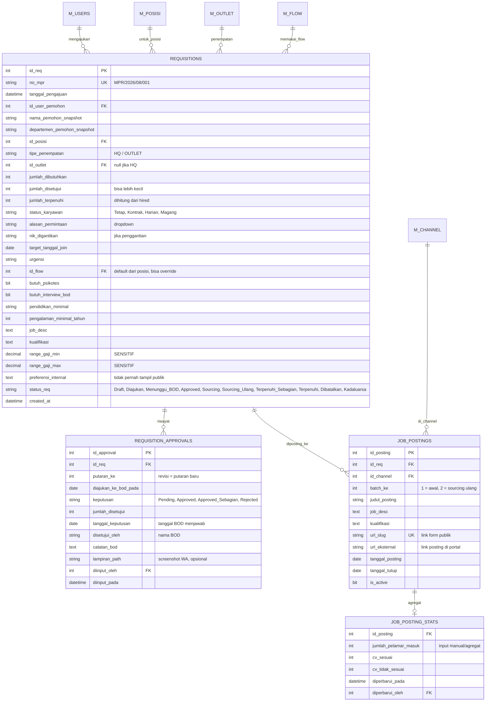
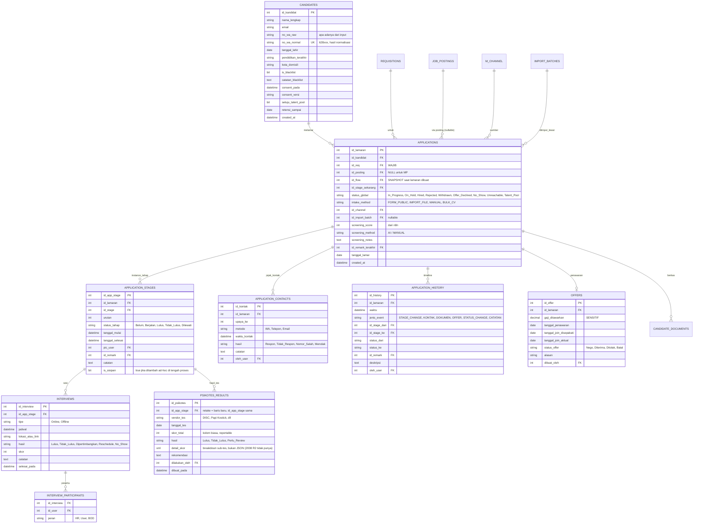
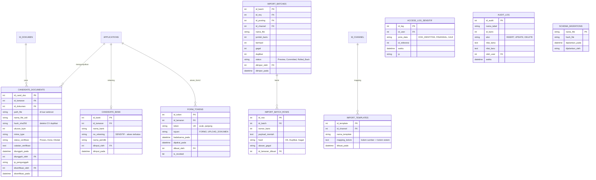

# ERD Terkoreksi & Dokumen Keputusan
## Sistem E-Recruitment Terintegrasi — Ratu Pertiwi Group

**Versi:** 1.2 (§7.3 ditambah tabel `PSIKOTES_RESULTS`, disinkronkan dengan Spesifikasi_Teknis_Database — 31 Agustus 2026)
**Tanggal:** 31 Agustus 2026
**Status:** Draft — struktur inti disepakati Kiki + Kahfi, menunggu jawaban HR (§13)
**Dokumen terkait:** Dokumen Spesifikasi & Rencana Implementasi v2.0 (Kahfi, 28 Agustus 2026), Bahan Diskusi Kahfi (31 Agustus 2026)

**Status persetujuan poin struktural:**
| Poin | Isi | Disepakati |
|---|---|---|
| 1 | `MASTER_STAGES` datar → Flow Template (`M_FLOW`/`M_FLOW_STAGE`), per kombinasi level posisi × tipe penempatan, bukan per posisi individual | ✅ Kahfi, 31 Agustus |
| 2 | Kebijakan (maks upaya kontak, dll) di tabel konfigurasi, bukan hardcode di SP | ✅ Kahfi, 31 Agustus |
| 3 | History terstruktur (`APPLICATION_STAGES`/`CONTACTS`/`INTERVIEWS`) + `APPLICATION_HISTORY` sebagai timeline, bukan satu tabel campuran | ✅ Kahfi, 31 Agustus |

---

## 0. Cara membaca dokumen ini

Dokumen ini **melengkapi**, bukan menggantikan, dokumen arsitektur v2.0 milik Kahfi. Prinsip Database-First, thin model, parameter binding, dan snapshot HRIS tetap dipakai.

Yang ditambahkan di sini:
1. Struktur tabel lengkap yang mendukung dua pipeline (HQ dan MP/outlet)
2. Konsep **flow template** supaya alur seleksi bisa diubah tanpa deploy
3. Jalur intake ganda (form publik + import dari portal + entry manual)
4. Seed data yang diambil dari data HR yang benar-benar berjalan
5. RBAC, retensi data, dan audit

Bagian yang **mengubah** dokumen v2.0 ditandai dengan simbol ⚠ dan disertai alasannya.

---

## 1. Keputusan yang sudah terkunci

| # | Keputusan | Status |
|---|---|---|
| 1 | Scope mencakup rekrutmen HQ **dan** MP/outlet | Terkunci |
| 2 | Stack: CodeIgniter 3, PHP 7.4, SQL Server 2008 R2 | Terkunci (lihat catatan §2) |
| 3 | Arsitektur Database-First, logika transaksi di Stored Procedure | Terkunci |
| 4 | File fisik disimpan di filesystem **di luar webroot**; database menyimpan path, hash, dan metadata | Terkunci |
| 5 | Approval BOD terjadi di WhatsApp, HR yang mencatat ke sistem | Terkunci |
| 6 | Tiga tingkat akses data: umum / dokumen identitas / finansial | Terkunci |
| 7 | Talent pool lintas posisi diizinkan, dengan masa simpan eksplisit | Terkunci |
| 8 | Lama proses dihitung dari tanggal permintaan; lama menunggu approval dipisah | Terkunci |
| 9 | Data historis 2026 dimigrasi (fase akhir) | Terkunci |
| 10 | Semua CV masuk ke sistem | Terkunci — jalur intake lihat §6 |

**Belum terjawab:**
- Apakah JobStreet & Glints mengizinkan external application URL
- Format export pelamar dari kedua portal (field apa saja, CV ikut atau tidak)
- Dari mana kandidat MP/outlet berasal (walk-in, referral, agen)
- Isi sheet Form Pengajuan & Persetujuan BOD (kosong di file HR)

---

## 2. ⚠ Blocker teknis yang harus dites sebelum Fase 1

Dokumen v2.0 menyebut kombinasi **ODBC Driver 11** dengan **php_sqlsrv_74_ts.dll**. Kombinasi ini kemungkinan besar tidak jalan.

- `php_sqlsrv_74_ts.dll` berasal dari Microsoft Drivers for PHP versi 5.8/5.9 (satu-satunya seri yang mendukung PHP 7.4).
- Release notes seri 5.x menyatakan rilis tersebut **membutuhkan ODBC Driver 17.4 atau lebih baru**.
- ODBC Driver 11 adalah syarat driver PHP **versi 3.x**, bukan 5.x.

**Kombinasi yang benar untuk dicoba:**

```
PHP 7.4 (TS/NTS sesuai Apache)
  + php_sqlsrv_74_*.dll / php_pdo_sqlsrv_74_*.dll  (v5.9)
  + Microsoft ODBC Driver 17 for SQL Server (17.4+)
  → SQL Server 2008 R2
```

ODBC Driver 17 masih mendukung SQL Server 2008 R2. **ODBC Driver 18 sudah tidak** — jangan sampai tim menginstal 18 karena "paling baru", koneksi akan gagal.

**Aksi Fase 0 (½ hari):** buat satu file `test-koneksi.php` yang menjalankan `SELECT @@VERSION`, `sqlsrv_client_info()`, dan satu `EXEC` stored procedure dummy dengan parameter binding. Jalankan di **mesin produksi**, bukan hanya Laragon. Sampai ini hijau, jangan mulai menulis SP.

**Catatan lingkungan:** dokumen v2.0 menyebut "PHP 7.4 (Laragon Development)". Laragon itu tool development lokal. Runtime produksi belum didefinisikan di mana pun. Perlu diputuskan: Windows Server + IIS, Windows + Apache, atau Linux + Nginx, plus siapa yang mengelolanya.

---

## 3. Batasan T-SQL SQL Server 2008 R2 yang harus diketahui penulis SP

Karena seluruh logika akan ditulis dalam T-SQL, ini yang **tidak tersedia** dan sering dipakai tanpa sadar:

| Tidak ada di 2008 R2 | Pakai ini |
|---|---|
| `OFFSET ... FETCH NEXT` | `ROW_NUMBER() OVER (...)` di CTE |
| `THROW` | `RAISERROR(@msg, 16, 1)` |
| `TRY_CONVERT`, `TRY_CAST` | `ISDATE()` / `ISNUMERIC()` + `CASE` |
| `CONCAT()`, `IIF()` | `+` dengan `ISNULL()`, dan `CASE WHEN` |
| Tipe/fungsi `JSON` | Normalisasi penuh. Jangan simpan JSON di kolom teks |
| `SEQUENCE` | `IDENTITY` |
| `FORMAT()` | `CONVERT()` dengan style code |
| `STRING_SPLIT` | Tabel bantu atau XML split |

Pagination daftar kandidat wajib pola `ROW_NUMBER()`. CI3 query builder driver sqlsrv menangani `limit()` dengan cara yang tidak konsisten, jadi tulis SP paginasi sendiri.

---

## 4. Konsep inti: Flow Template

Ini bagian yang paling menentukan apakah sistem benar-benar fleksibel.

### Masalahnya

Data HR menunjukkan minimal dua alur yang sangat berbeda:

| | HQ | MP / Outlet |
|---|---|---|
| Job posting | Ya, JobStreet/Glints | Tidak ada |
| Tahapan | 6–9 tahap | 2 tahap |
| Lama proses | Mingguan | 1–2 hari |
| Volume | 7 posisi | 11 permintaan / 4 hari kerja |

Ditambah rencana psikotes internal, dan kasus "staff tapi posisi krusial ikut sampai BOD".

### ⚠ Perubahan terhadap dokumen v2.0

Dokumen v2.0 (Rule 05) menempatkan aturan SOP seperti *"gugur otomatis jika 3× kontak tidak direspons"* sebagai blok `IF/BEGIN...END` di dalam Stored Procedure.

**Masalahnya:** setiap kali HR mengubah kebijakan (jadi 4 kali, atau berbeda antara HQ dan MP), harus `ALTER PROCEDURE` dan deploy ulang lewat SSMS. Itu bertentangan langsung dengan kebutuhan "sistem sefleksibel mungkin".

**Usulan penyelesaian — tetap Database-First, tapi SP membaca konfigurasi, bukan menghardcode-nya:**

- Logika transaksional (`BEGIN TRAN`, penguncian baris, atomicity, penulisan histori) **tetap di SP**. Ini yang memang kuat di database.
- Parameter kebijakan (jumlah maksimal upaya kontak, SLA per tahap, tahap mana yang wajib) **disimpan di tabel konfigurasi** yang dibaca SP saat runtime.

Contoh: alih-alih `IF @upaya >= 3`, SP membaca `SELECT @maks = maks_upaya_kontak FROM M_FLOW WHERE id_flow = @id_flow`. Sama-sama satu SP, sama-sama atomik, tapi HR bisa mengubah angkanya lewat halaman master tanpa developer.

Aturan pembagiannya:

| Layak dikonfigurasi (tabel) | Wajib di kode/SP |
|---|---|
| Jumlah & urutan tahap per flow | Struktur entitas inti |
| Tahap opsional atau wajib | Aturan dedupe kandidat |
| SLA per tahap | Transaksi & penguncian baris |
| Batas upaya kontak | Daftar `status_global` (terkunci) |
| Dokumen wajib per tahap | Audit trail |
| Daftar alasan/remark | Hak akses |

`status_global` sengaja **tidak** dibuat konfigurasi. Kalau user bisa menambah status sendiri, seluruh dashboard rusak dan tidak ada yang tahu penyebabnya.

---

## 5. ⚠ Catatan terhadap Rule 04 (Single Source of Truth)

Dokumen v2.0 menyatakan seluruh riwayat lamaran, tahapan, jejak kontak, dan penolakan wajib bermuara di satu tabel `APPLICATION_HISTORY`.

**Niatnya benar** — menghindari pencatatan status ganda yang saling bertentangan adalah prinsip yang tepat. **Tapi bentuknya bermasalah.** Keempat hal itu punya atribut yang sangat berbeda:

- Tahapan butuh: jadwal, PIC, status per tahap, hasil
- Jejak kontak butuh: upaya ke-berapa, metode, respons
- Interview butuh: interviewer (bisa lebih dari satu), skor, catatan
- Penolakan butuh: kode alasan terstruktur

Kalau dipaksa satu tabel, hasilnya salah satu dari dua ini: tabel lebar dengan puluhan kolom yang mayoritas `NULL`, atau satu kolom teks berisi data campuran. SQL Server 2008 tidak punya tipe JSON, jadi opsi kedua akan jadi teks bebas yang tidak bisa di-query. Modul Report akan mentok di situ.

**Usulan:** pertahankan prinsipnya, ubah implementasinya.

- `APPLICATION_STAGES`, `APPLICATION_CONTACTS`, `INTERVIEWS`, `OFFERS` = tabel terstruktur, tempat data *hidup*
- `APPLICATION_HISTORY` = tabel jejak kronologis (append-only) untuk audit dan timeline UI, ditulis **oleh SP yang sama** yang mengubah tabel terstruktur

Dengan begitu tetap satu sumber kebenaran (SP yang menulis), tetap satu timeline untuk ditampilkan, tapi datanya tetap bisa dihitung.

---

## 6. Jalur intake — empat pintu, satu tabel

Karena kebijakan external apply URL di JobStreet/Glints belum pasti, sistem dirancang supaya jawabannya tidak menentukan apa-apa.

| `intake_method` | Untuk | Prioritas |
|---|---|---|
| `IMPORT_FILE` | Export pelamar dari JobStreet / Glints | **Fase 1** — wajib apa pun jawabannya |
| `MANUAL` | MP outlet, walk-in, referral | **Fase 1** |
| `FORM_PUBLIC` | Redirect portal, QR walk-in, link di job desc | Fase 1, tapi bukan pintu utama |
| `BULK_CV` | HR upload banyak CV → parsing n8n | Fase 2 |

⚠ Dokumen v2.0 hanya mengenal satu pintu (`sp_SubmitApplication` dari Form 1). Data HR menunjukkan 949 pelamar dalam satu siklus masuk lewat JobStreet dan Glints, bukan lewat form sendiri. Tanpa jalur import, HR harus mengetik ulang ratusan baris dan sistem akan ditinggalkan.

---

## 7. ERD

### 7.1 Master & Referensi

```mermaid
erDiagram
    M_ROLES ||--o{ M_USERS : memiliki
    M_ROLES ||--o{ M_ROLE_PERMISSIONS : punya
    M_PERMISSIONS ||--o{ M_ROLE_PERMISSIONS : diberikan
    M_DEPARTEMEN ||--o{ M_POSISI : menaungi
    M_FLOW ||--o{ M_POSISI : "default flow"
    M_FLOW ||--o{ M_FLOW_STAGE : terdiri_dari
    M_STAGE ||--o{ M_FLOW_STAGE : dipakai_di
    M_FLOW_STAGE ||--o{ M_FLOW_STAGE_DOKUMEN : mensyaratkan
    M_DOKUMEN ||--o{ M_FLOW_STAGE_DOKUMEN : direferensi
    M_STAGE ||--o{ M_REMARKS : punya_opsi

    M_USERS {
        int id_user PK
        string nik_karyawan "snapshot dari HRIS"
        string username UK
        string password_hash
        string nama_snapshot
        string departemen_snapshot
        datetime snapshot_pada
        int id_role FK
        bit is_active
    }
    M_ROLES {
        int id_role PK
        string kode_role "IT_ADMIN, HR_ADMIN, HR_SPV, USER_DEPT, BOD, VIEWER"
        string nama_role
    }
    M_PERMISSIONS {
        int id_permission PK
        string kode "LIHAT_CV, LIHAT_DOK_IDENTITAS, LIHAT_FINANSIAL, APPROVE, EXPORT, EDIT_FLOW_TEMPLATE"
    }
    M_ROLE_PERMISSIONS {
        int id_role FK
        int id_permission FK
    }
    M_DEPARTEMEN {
        int id_departemen PK
        string kode
        string nama
    }
    M_OUTLET {
        int id_outlet PK
        string kode_outlet UK "Z-MKTR, K-LC3, I-TCM"
        string nama_outlet
        string brand "Naughty, SOYU, Les Femmes"
        string region
        bit is_active
    }
    M_POSISI {
        int id_posisi PK
        string nama_posisi UK
        int id_departemen FK
        string level_posisi "MP, Staff, Staff_Krusial, Spv, Manager, Senior_Manager"
        int default_flow FK
        bit is_active
    }
    M_FLOW {
        int id_flow PK
        string kode_flow "HQ_MANAGER, HQ_STAFF, HQ_STAFF_KRUSIAL, MP_OUTLET"
        string nama_flow
        string tipe_penempatan "HQ / OUTLET"
        int maks_upaya_kontak "default 3, per flow"
        int sla_total_hari
        bit is_active
    }
    M_STAGE {
        int id_stage PK
        string kode_stage
        string nama_tahap
        string tipe_tahap "SCREENING, KONTAK, INTERVIEW, TEST, FORM, OFFER, ONBOARD"
        bit is_terminal
    }
    M_FLOW_STAGE {
        int id_flow_stage PK
        int id_flow FK
        int id_stage FK
        int urutan
        bit is_wajib "false = bisa dilewati"
        int sla_hari
        string role_pic "siapa yang menjalankan"
    }
    M_DOKUMEN {
        int id_dokumen PK
        string nama_dokumen "KTP, KK, Ijazah, NPWP, Rekening"
        string kategori "IDENTITAS, PENDIDIKAN, FINANSIAL"
        string tingkat_sensitif "UMUM, IDENTITAS, FINANSIAL"
        bit is_mandatory_default
    }
    M_FLOW_STAGE_DOKUMEN {
        int id_flow_stage FK
        int id_dokumen FK
        bit is_wajib "wajib sebelum tahap ini lulus"
    }
    M_REMARKS {
        int id_remark PK
        int id_stage FK "opsi muncul sesuai tahap"
        string kode_remark
        string label
        string efek_status "LANJUT, TOLAK, ON_HOLD, WITHDRAWN, HIRED, NO_SHOW"
        bit is_aktif
    }
    M_CHANNEL {
        int id_channel PK
        string nama_channel "JobStreet, Glints, Portal Sendiri, Referral, Walk-in"
        bit is_eksternal
    }
```



**Catatan `M_FLOW_STAGE_DOKUMEN`** — ini yang menyelesaikan perdebatan kapan Form 2 dikirim. Dokumen tidak lagi terikat pada satu titik tetap di alur; setiap tahap bisa mensyaratkan set dokumennya sendiri. Flow manager: Form Pelamar wajib sebelum tahap BOD. Flow staff: wajib sebelum onboarding. Satu mekanisme, dua kebijakan, tanpa percabangan di kode.

**Catatan `M_REMARKS`** — ini persis konsep cascading dropdown di dokumen v2.0, dengan tambahan kolom `efek_status`. SP membaca kolom itu untuk menentukan perubahan `status_global`, jadi aturannya jadi data, bukan `IF` bertingkat di dalam SP.

### 7.2 Requisition & Posting



**Kenapa `JOB_POSTING_STATS` terpisah dan diisi manual:** selama sebagian pelamar tidak masuk sistem satu per satu, angka funnel teratas tidak bisa dihitung otomatis. Sheet HR sekarang sudah mencatat ketiga angka ini, jadi teruskan kebiasaan itu. Begitu import berjalan penuh, angka ini bisa direkonsiliasi dengan hitungan sistem dan selisihnya justru jadi indikator kelengkapan data.

**`REQUISITION_APPROVALS` terpisah dari `REQUISITIONS`** karena pengajuan bisa ditolak lalu diajukan ulang dengan jumlah berbeda. Satu kolom `status_approval` akan menghapus riwayat itu.

### 7.3 Kandidat, Lamaran & Proses Seleksi



**Catatan `PSIKOTES_RESULTS`** — ditambahkan Fase 2, saat psikotes internal mulai berjalan (lihat §4, kolom `butuh_psikotes` di `REQUISITIONS`). Sama seperti `INTERVIEWS`, menempel ke `APPLICATION_STAGES` (bukan langsung ke `APPLICATIONS`), supaya kandidat yang tes ulang cukup jadi baris baru dengan `id_app_stage` yang sama — bukan kolom tambahan. `skor_total` dan `hasil` sengaja jadi kolom bertipe jelas karena akan dipakai Modul Report (rata-rata skor per posisi, dll); `detail_skor` memakai tipe `xml` — bukan JSON, karena SQL Server 2008 R2 tidak punya tipe JSON — khusus untuk breakdown sub-skor yang strukturnya beda tiap vendor tes dan jarang perlu dihitung per sub-skor di level SQL.

**Belum final:** apakah `INTERVIEWS` dan `PSIKOTES_RESULTS` perlu kolom `id_lamaran` tambahan (redundan dengan `id_app_stage → APPLICATION_STAGES → APPLICATIONS`) untuk mempermudah query report tanpa join berlapis. Direkomendasikan tetap normalized (tanpa kolom tambahan) dan pakai tabel agregat harian untuk report — lihat rincian trade-off di dokumen *Spesifikasi_Teknis_Database_E-Recruitment_RPG.md* §6.1. Perlu dipastikan oleh Kahfi sebelum DDL Fase 1.

### 7.4 Dokumen, Data Sensitif & Import



**`FORM_TOKENS`** mengadopsi ide tokenisasi URL dari dokumen v2.0, dengan tambahan: token terikat ke `id_lamaran`, punya masa berlaku, tercatat kapan dipakai, dan bisa dicabut. HR juga bisa generate ulang kalau kandidat kehilangan link.

**`SCHEMA_MIGRATIONS`** menjawab masalah yang tidak dibahas di dokumen v2.0: file `.sql` disimpan di Git dan dijalankan manual lewat SSMS, tapi tidak ada cara mengetahui skrip mana yang sudah dijalankan di environment mana. Tanpa tabel ini, development dan produksi akan menyimpang tanpa ketahuan. Setiap skrip mencatat dirinya ke tabel ini di akhir eksekusi.

---

## 8. Seed Data

Diambil dari nilai yang benar-benar dipakai HR di spreadsheet, bukan karangan.

### M_STAGE

| kode | nama_tahap | tipe |
|---|---|---|
| SOURCING | Sourcing | SCREENING |
| SCREENING_CV | Screening CV | SCREENING |
| KONTAK_WA | Kontak Kandidat | KONTAK |
| INT_HR | Interview HR | INTERVIEW |
| FORM_PELAMAR | Pengisian Form Pelamar | FORM |
| PSIKOTES | Psikotes | TEST |
| INT_USER | Interview User | INTERVIEW |
| INT_BOD | Interview BOD | INTERVIEW |
| OFFER | Penawaran & Negosiasi | OFFER |
| ONBOARD | Onboarding & Pemberkasan | ONBOARD |

### M_FLOW

| kode_flow | Tahapan | maks_upaya_kontak |
|---|---|---|
| `HQ_MANAGER` | SOURCING → SCREENING_CV → KONTAK_WA → INT_HR → FORM_PELAMAR → PSIKOTES(opsional) → INT_USER → INT_BOD → OFFER → ONBOARD | 3 |
| `HQ_STAFF` | SOURCING → SCREENING_CV → KONTAK_WA → INT_HR → FORM_PELAMAR → INT_USER → OFFER → ONBOARD | 3 |
| `HQ_STAFF_KRUSIAL` | sama dengan HQ_STAFF + INT_BOD sebelum OFFER | 3 |
| `MP_OUTLET` | KONTAK_WA → ONBOARD | 2 |

### status_global (terkunci, hanya developer)

| Nilai | Asal di data HR |
|---|---|
| `In_Progress` | proses berjalan |
| `On_Hold` | "Di Pertimbangkan (mencari kandidat pembanding)" |
| `Unreachable` | tidak dapat dihubungi — **reversible**, bukan Rejected |
| `Rejected` | "tidak lanjut" |
| `Withdrawn` | mundur sendiri di tengah proses |
| `Offer_Declined` | "Gagal karena Cdd dapat offering dari perusahaan lain" |
| `No_Show` | "Gagal Join" |
| `Hired` | "Join [tgl]" |
| `Talent_Pool` | ditolak tapi disimpan untuk posisi lain |

⚠ Dokumen v2.0 dan ERD awal hanya mengenal empat status (In_Progress, Hired, Rejected, Withdrawn). Lima status sisanya di atas semuanya muncul di data HR Agustus 2026.

### M_REMARKS (contoh, per tahap)

| Tahap | Remark | efek_status |
|---|---|---|
| SCREENING_CV | Kualifikasi tidak sesuai | TOLAK |
| SCREENING_CV | Pengalaman kurang | TOLAK |
| SCREENING_CV | Lolos screening | LANJUT |
| KONTAK_WA | Tidak respons setelah batas upaya | TOLAK (Unreachable) |
| KONTAK_WA | Nomor tidak aktif | TOLAK (Unreachable) |
| KONTAK_WA | Kandidat menolak proses | WITHDRAWN |
| INT_HR | Lulus interview HR | LANJUT |
| INT_HR | Dipertimbangkan / cari pembanding | ON_HOLD |
| INT_HR | Tidak lulus | TOLAK |
| INT_HR | Ekspektasi gaji tidak sesuai | TOLAK |
| OFFER | Menerima offer | LANJUT |
| OFFER | Dapat offering perusahaan lain | OFFER_DECLINED |
| OFFER | Nego tidak sepakat | TOLAK |
| ONBOARD | Join sesuai jadwal | HIRED |
| ONBOARD | Tidak hadir di hari join | NO_SHOW |

---

## 9. Aturan bisnis yang wajib ditegakkan di SP

1. **Flow di-snapshot.** Saat lamaran dibuat, `id_flow` disalin ke `APPLICATIONS` dan seluruh `APPLICATION_STAGES` di-generate. Perubahan `M_FLOW` setelahnya **tidak** mengubah lamaran yang sedang berjalan. Tanpa aturan ini, HR menambah satu tahap dan 200 lamaran aktif berubah alurnya diam-diam.
2. **Tahap sisipan.** HR boleh menambah tahap ad-hoc ke satu lamaran (`is_sisipan = 1`) tanpa mengubah template. Ini yang menangani "posisi ini ternyata perlu interview tambahan".
3. **Dedupe kandidat** berdasarkan `no_wa_normal`, lalu `email`, lalu `hash_sha256` CV. Normalisasi wajib: `0812…`, `62 812…`, `+62812…` semuanya jadi `62812…`.
4. **Batas kontak dibaca dari `M_FLOW.maks_upaya_kontak`**, bukan angka tetap di dalam SP.
5. **Status `Unreachable` reversible.** Kandidat yang HP-nya mati seminggu tidak boleh hilang permanen.
6. **`jumlah_terpenuhi`** dihitung dari lamaran berstatus `Hired`. Requisition otomatis `Terpenuhi` saat sama dengan `jumlah_disetujui`.
7. **Dua metrik waktu terpisah:** `lama_proses` dari tanggal permintaan (sesuai keputusan HR), dan `hari_menunggu_approval` dari diajukan_ke_bod sampai tanggal_keputusan. Yang kedua bukan tanggung jawab HR, jadi jangan dicampur.
8. **Setiap perubahan status menulis ke `APPLICATION_HISTORY`** di dalam transaksi yang sama.

---

## 10. Matriks Hak Akses

| Data | IT Admin | HR Admin | HR Spv | User Dept | BOD | Catatan |
|---|---|---|---|---|---|---|
| Daftar kandidat, ringkasan | ❌ | ✅ | ✅ | ✅ req sendiri | ✅ req sendiri | |
| CV | ❌ | ✅ | ✅ | ✅ req sendiri | ✅ req sendiri | |
| Hasil & catatan interview | ❌ | ✅ | ✅ | ✅ yang dia ikuti | ✅ | |
| KTP, KK, Ijazah, NPWP | ❌ | ✅ | ✅ | ❌ | ❌ | dicatat di `ACCESS_LOG_SENSITIF` |
| Rekening bank | ❌ | ❌ | ✅ | ❌ | ❌ | dicatat di log |
| Range gaji & offer | ❌ | ❌ | ✅ | ❌ | ✅ | dicatat di log |
| Master flow, stage, remark (`EDIT_FLOW_TEMPLATE`) | ✅ | ❌ | 🔒 disiapkan, belum diaktifkan | ❌ | ❌ | lihat §10.1 |

### 10.1 Rencana pembukaan akses `EDIT_FLOW_TEMPLATE` ke HR Spv

Fase awal: hanya role `IT_ADMIN` yang punya permission ini (baris di `M_ROLE_PERMISSIONS` hanya untuk `IT_ADMIN`). Skema `M_ROLE_PERMISSIONS` sudah mendukung ini tanpa kerja tambahan — role `HR_SPV` sudah bisa dibuat sejak awal, permission-nya saja yang belum di-grant.

**Syarat pembukaan ke HR Spv** (pilih salah satu, agar tidak jadi "nanti" tanpa batas):
- Sudah 2 siklus rekrutmen penuh berjalan di sistem tanpa insiden data pada `M_FLOW`, atau
- 2 bulan sejak go-live, mana pun yang lebih dulu tercapai

Saat dibuka: insert satu baris ke `M_ROLE_PERMISSIONS` (role `HR_SPV` → permission `EDIT_FLOW_TEMPLATE`), dicatat di `AUDIT_LOG` siapa yang membuka dan kapan. Tidak perlu perubahan kode atau deploy.

⚠ Keputusan awal "dokumen sensitif hanya HR" saya pecah jadi tiga tingkat. Kalau user departemen tidak bisa melihat CV sama sekali, mereka akan minta dikirim lewat WhatsApp dan sistem terlewat justru di tahap yang paling penting.

---

## 11. Retensi & Persetujuan Data

Sistem menyimpan KTP, KK, dan ijazah kandidat, termasuk yang tidak diterima. UU PDP 27/2022 sudah berlaku. Yang perlu ada sejak awal:

- Checkbox persetujuan di Form 1, dengan versi teks tersimpan (`consent_versi`)
- Checkbox terpisah untuk talent pool: "data saya boleh disimpan untuk lowongan lain"
- `retensi_sampai` diisi otomatis: default 12 bulan sejak lamaran ditolak, atau 24 bulan jika setuju talent pool
- Job terjadwal yang menghapus file fisik dan meng-anonimkan baris kandidat yang lewat masa retensi
- Karena tidak ada SQL Server Agent di semua edisi, penjadwalan pakai Windows Task Scheduler atau cron yang memanggil skrip

Ini murah dipasang sekarang dan mahal ditambal belakangan.

---

## 12. Usulan Revisi Rencana Fase

Rencana di dokumen v2.0 menempatkan seluruh T-SQL di Fase 1 dan pengujian siklus penuh di Fase 5. Risikonya: hal-hal yang paling mungkin membatalkan desain baru ketahuan di akhir.

**Fase 0 — Validasi Asumsi (3–5 hari, sebelum menulis SP apa pun)**
- Tes koneksi PHP 7.4 + sqlsrv 5.9 + ODBC 17 → SQL Server 2008 R2 di mesin produksi
- Minta HR export sample pelamar dari JobStreet dan Glints (field apa saja? CV ikut?)
- Telusuri 3 rekrutmen nyata yang sudah selesai (1 staff, 1 staff krusial, 1 manager) di atas schema ini, di atas kertas
- Tanyakan asal kandidat MP/outlet
- Konfirmasi format Form Pengajuan & Persetujuan BOD ke HR (sheet-nya kosong)
- **Checkpoint:** tidak ada kolom baru yang dibutuhkan setelah menelusuri ketiga kasus nyata

Fase 1–5 berikutnya mengikuti struktur dokumen v2.0, dengan tambahan:
- Fase 1: seeding `M_FLOW`, `M_FLOW_STAGE`, `M_STAGE`, `M_REMARKS`, dan tabel `SCHEMA_MIGRATIONS`
- Fase 3: modul import (`IMPORT_BATCHES`) dikerjakan bersamaan dengan form publik, bukan setelahnya
- Fase 4: mode entry cepat untuk MP (satu layar: nama, WA, outlet, tanggal join)
- Fase 5: ditambah UAT bersama HR memakai data nyata, dan migrasi data historis 2026
- Sebelum Go-Live: rencana backup database **dan direktori file**, plus rencana rollback

---

## 13. Daftar Pertanyaan untuk HR

1. Sheet Form Pengajuan & Persetujuan BOD kosong — memang belum berjalan, atau formatnya ada di tempat lain?
2. Kandidat MP/outlet datang dari mana? Walk-in, referral karyawan, agen, atau grup WA?
3. Satu requisition bisa untuk berapa orang? Bagaimana kalau disetujui sebagian?
4. Ada tahap offer/negosiasi gaji resmi? Angkanya dicatat di sistem?
5. Berapa lama dokumen kandidat yang tidak diterima boleh disimpan?
6. Kontak WA ke kandidat: manual dari HP HR, atau mau diotomatiskan?
7. Batas upaya kontak: 3 kali untuk semua, atau beda antara HQ dan MP?
8. "Dipertimbangkan" itu cadangan untuk posisi yang sama saja, atau bisa ditawarkan ke posisi lain?
9. Siapa yang boleh melihat nomor rekening dan range gaji?
10. Preferensi usia/jenis kelamin: disimpan sebagai catatan internal saja, atau perlu tampil di posting?

---

## 14. Ringkasan perbedaan dengan dokumen v2.0

| # | Dokumen v2.0 | Usulan di sini | Alasan |
|---|---|---|---|
| 1 | ODBC Driver 11 | ODBC Driver 17.4+ | Driver PHP 5.9 mensyaratkan 17.4+ |
| 2 | Aturan SOP di dalam `IF/BEGIN` di SP | Parameter kebijakan di tabel konfigurasi, dibaca SP | Supaya perubahan kebijakan tidak perlu deploy |
| 3 | Satu `APPLICATION_HISTORY` untuk semua | History untuk timeline + tabel terstruktur untuk data | 2008 tidak punya JSON; report butuh kolom yang bisa di-query |
| 4 | `MASTER_STAGES` datar dengan `urutan` | `M_FLOW` + `M_FLOW_STAGE` | Alur HQ dan MP berbeda jauh |
| 5 | Hanya alur HQ | HQ + MP/outlet | Volume MP lebih besar |
| 6 | Satu pintu intake (Form 1) | Empat pintu, `intake_method` | 949 pelamar datang lewat portal eksternal |
| 7 | 4 status global | 9 status global | Lima sisanya ada di data HR nyata |
| 8 | Approval di sistem oleh HR | `REQUISITION_APPROVALS` dengan tanggal keputusan BOD terpisah | Approval nyata terjadi di WhatsApp |
| 9 | "Validasi sesi & proteksi route" | RBAC tiga tingkat + log akses data sensitif | Sistem menyimpan KTP dan nomor rekening |
| 10 | Tidak ada retensi data | `consent`, `retensi_sampai`, job penghapusan | UU PDP 27/2022 |
| 11 | Skrip dijalankan manual via SSMS | Ditambah `SCHEMA_MIGRATIONS` | Tanpa itu, dev dan produksi menyimpang tanpa ketahuan |
| 12 | Tidak ada `jumlah_dibutuhkan` | Ada, plus `jumlah_disetujui` dan `jumlah_terpenuhi` | Fill rate dan penutupan requisition |
